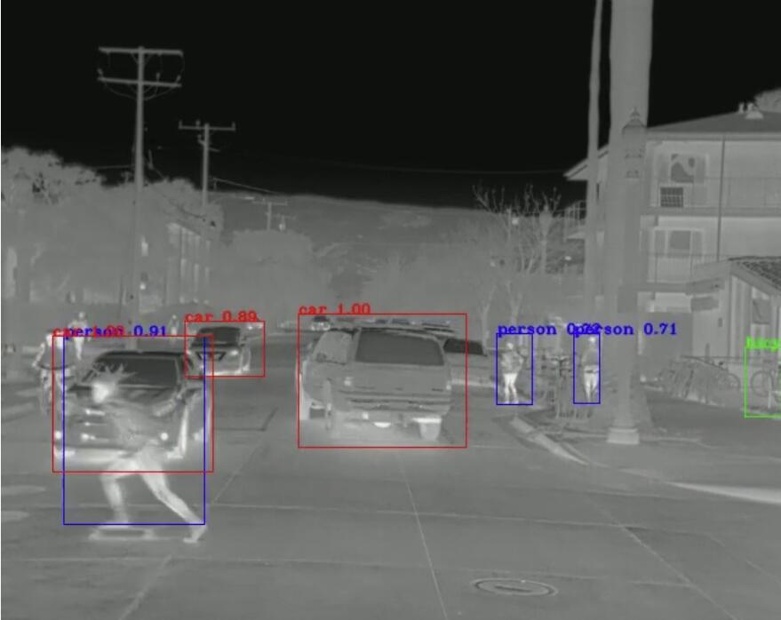

## YOLOV3's pytorch edition with many Tricks embedded
#### Adding my new modules on Darknet has a lot of trouble to do,then i implement a full-edition yolov3 with many tricks on Pytorch
### [Open source object detection dataset of pedestrain and vehicles:FLIR](https://www.flir.com/oem/adas/adas-dataset-form/)

-------
### Performance
||mAP|Car|Person|bike|
|-|-|-|-|-|
|Official Baseline|74.3%|85.6%|79.4%|58.0%|
|Ours|77.0%|89.2%|80.1%|61.9%|

### TODO
- [ ] Focal loss
- [ ] GIOU loss
- [ ] CIOU loss
- [ ] Smooth L1 loss
- [x] Soft NMS
- [x] And NMS
- [x] Merge NMS
- [ ] PANet
- [ ] Mosaic
- [ ] CutOut
- [ ] CutMix
- [x] RandomFlip
- [ ] Mish

-----------
### Example Projects
- https://github.com/zylo117/Yet-Another-EfficientDet-Pytorch
- https://github.com/ayooshkathuria/YOLO_v3_tutorial_from_scratch